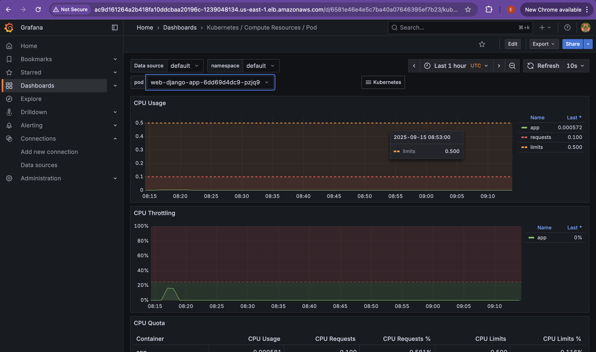
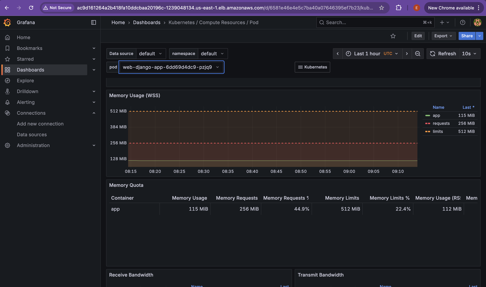

## Prereqs

AWS CLI v2, kubectl, Helm 3, Terraform ≥ 1.6, Docker (Buildx), jq

An AWS account with permissions for EKS/ECR/EC2/ELB/IAM/RDS/CloudWatch/Secrets Manager

Environment variables:

```
export AWS_REGION=us-east-1
export PROJECT=cognetiks-tech
export ACCOUNT_ID=$(aws sts get-caller-identity --query Account --output text)
```

## Provision VPC, EKS & RDS with Terraform

From infrastructure/:

```
cd Technical_DevOps_app/eks/infrastructure

terraform init

# Set/confirm variables in terraform.tfvars (project, region, cidrs, node sizes, etc.)

terraform plan
terraform apply

```


Outputs to note (or fetch with terraform output):

eks_cluster_name

rds_endpoint

optional db_secret_arn (if you created one in secrets.tf)

Configure the kube context (if the local-exec didn’t already do this):

```
aws eks update-kubeconfig --name ${PROJECT}-eks --region ${AWS_REGION} --alias ${PROJECT}-eks
kubectl config use-context ${PROJECT}-eks
```

## Build & Push the Docker image to ECR

Create the repo once (idempotent):

```
aws ecr describe-repositories --repository-names ${PROJECT}-app \
  >/dev/null 2>&1 || \
aws ecr create-repository --repository-name ${PROJECT}-app
```


Login & push:

```
aws ecr get-login-password --region $AWS_REGION \
 | docker login --username AWS --password-stdin ${ACCOUNT_ID}.dkr.ecr.${AWS_REGION}.amazonaws.com
```

```
cd Technical_DevOps_app
docker build -t ${PROJECT}-app:latest .

docker tag  ${PROJECT}-app:latest \
  ${ACCOUNT_ID}.dkr.ecr.${AWS_REGION}.amazonaws.com/${PROJECT}-app:latest

docker push ${ACCOUNT_ID}.dkr.ecr.${AWS_REGION}.amazonaws.com/${PROJECT}-app:latest
```


## Install monitoring (Prometheus + Grafana)

We’ll use kube-prometheus-stack and expose Grafana via ELB:

```
cd Technical_DevOps_app/eks/django-app
helm repo add prometheus-community https://prometheus-community.github.io/helm-charts
helm repo update

helm upgrade --install monitoring prometheus-community/kube-prometheus-stack \
  --namespace monitoring --create-namespace \
  --set grafana.service.type=LoadBalancer \
  --set grafana.adminPassword='admin123' \
  --set grafana.defaultDashboardsEnabled=true


Get Grafana URL & login:

```
kubectl -n monitoring get svc monitoring-grafana
```

# EXTERNAL-IP -> http://<elb-dns>
# user: admin   pass: admin123 (or: kubectl -n monitoring get secret monitoring-grafana -o jsonpath='{.data.admin-password}' | base64 -d; echo)


Prometheus is ClusterIP (by design). To browse it:

```kubectl -n monitoring port-forward svc/monitoring-kube-prometheus-prometheus 9090
# open http://localhost:9090
```

## Helm-deploy the Django app to EKS
4.1 App chart defaults to a Network Load Balancer

The chart exposes a Service as LoadBalancer with NLB annotations; the app listens on 8000, service listens on 80.

4.2 Fetch DB credentials from Secrets Manager. This was supplied earlier through Terraform (infrastructure/secrets.yaml)

Create a values overlay from the Secrets Manager JSON:

```
DB_SECRET_ARN=$(terraform -chdir=infrastructure output -raw db_secret_arn 2>/dev/null || true)
if [ -z "$DB_SECRET_ARN" ]; then
  # fallback: put your secret ARN manually
  DB_SECRET_ARN="arn:aws:secretsmanager:...:secret:..."
fi

aws secretsmanager get-secret-value \
  --region $AWS_REGION --secret-id "$DB_SECRET_ARN" \
  --query SecretString --output text | jq . > /tmp/db.json

cat >/tmp/db-values.yaml <<EOF
db:
  host:     $(jq -r .host     /tmp/db.json)
  name:     $(jq -r .dbname   /tmp/db.json)
  username: $(jq -r .username /tmp/db.json)
  password: $(jq -r .password /tmp/db.json)
  port:     $(jq -r .port     /tmp/db.json)
EOF
```

4.3 Enable metrics from the app
```
NS=web
helm upgrade --install web ./eks/django-app -n "$NS" --create-namespace \
  -f /tmp/db-values.yaml -f /tmp/metrics-values.yaml \
  --set image.repository="${ACCOUNT_ID}.dkr.ecr.${AWS_REGION}.amazonaws.com/${PROJECT}-app" \
  --set image.tag="latest" \
  --set env.DJANGO_SETTINGS_MODULE="mysite.settings_local" \
  --set env.ALLOWED_HOSTS="*" \
  --set service.type=LoadBalancer \
  --set service.annotations."service\.beta\.kubernetes\.io/aws-load-balancer-type"=nlb \
  --set service.annotations."service\.beta\.kubernetes\.io/aws-load-balancer-scheme"=internet-facing \
  --set service.annotations."service\.beta\.kubernetes\.io/aws-load-balancer-nlb-target-type"=ip 
```

4.5 Verify
```
kubectl -n $NS get pods -o wide
kubectl -n $NS get svc web-django-app
# open http://<NLB-DNS>/
```

## Grafana dashboards





## HPA

HPA is part of the chart (templates/hpa.yaml). It scales on CPU usage:

```kubectl -n $NS get hpa```


Change targets in values.yaml:

```
hpa:
  enabled: true
  minReplicas: 2
  maxReplicas: 6
  targetCPUUtilizationPercentage: 70
```

## Clean up
```
# App
helm uninstall web -n web
kubectl delete ns web

# Monitoring
helm uninstall monitoring -n monitoring
kubectl delete ns monitoring

# Infra
cd infrastructure
terraform destroy -auto-approve

# Delete ECR repo/images when done
aws ecr delete-repository --repository-name ${PROJECT}-app --force

# Delete infrastructure
cd Technical_DevOps_app/eks/infrastructure
terraform destroy
```

